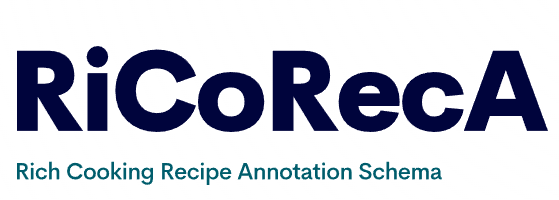

# RiCoRecA: Rich Cooking Recipe Annotation Schema

### About
The repository supports the annotations and experiments done in te paper "RiCoRecA: Rich Cooking Recipe Annotation Schema".

These are the three main repositories, each is tested with its own Python environment.

### <ins>preprocessing-annotation:</ins> 
Is responsible for pre-processing the data and running the Prodigy interface to annotate.

### <ins>recipe-transformation-evaluation:</ins>
- Calculates the interannotator agreement.
- Generates the files for PEGASUS-X and LongT5 5-Fold Cross-Validation.
- Calculates the above scores.

### <ins>recipe-transformation-evaluation:</ins> 
Performs the 5-Fold Cross Validation for PEGASUS-X and LongT5.

---

Each repository has its own README and can be re-produced without depending on the other. The data can be found in figshare.com/TBC.

## Data
The data folder can be downloaded from [figshare](https://figshare.com/articles/dataset/RiCoRecA_i_Ri_i_ch_i_Co_i_oking_i_Rec_i_ipe_i_A_i_nnotation_Schema_Dataset_/22317796).

## Annotation & Annotation UI guidelines
Moreover, if one is interested for the annotation guidelines and the Prodigy usage guideline, these can be found in [figshare](https://figshare.com/articles/online_resource/RiCoRecA_i_Ri_i_ch_i_Co_i_oking_i_Rec_i_ipe_i_A_i_nnotation_Schema_Annotation_Interface_Guidelines_/25853902) as well.

## Tech Stack

**Annotation GUI:** spaCy Prodigy

**Transformers:** HuggingFace Transformers, PyTorch

## Acknowledgements

 - The project was possible due to EPSRC and Arm funding.

 ## Feedback

If you have any feedback, please reach out to us at ~filippos.ventirozos@postgrad.manchester.ac.uk~ f.ventirozos@mmu.ac.uk.
